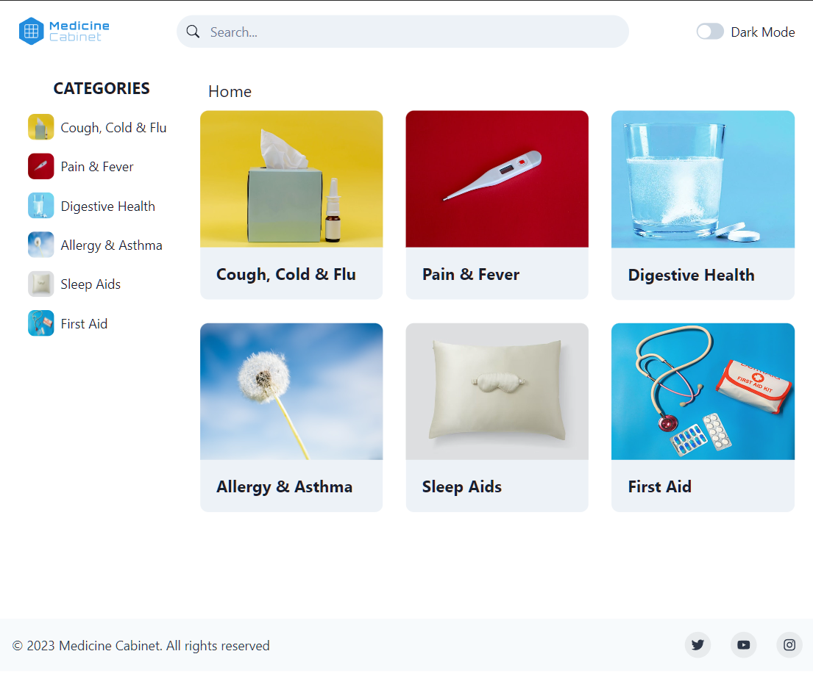

<!-- PROJECT LOGO -->

  <h1 align="center">Medicine Cabinet</h1>

  
 
    <a href="https://github.com/feliceforgione/medicineCabinet/issues">Report Bug</a>
    ·
    <a href="https://github.com/feliceforgione/medicineCabinet/issues">Request Feature</a>
  

<!-- ABOUT THE PROJECT -->
 

## About The Project

Front end for <a href="https://github.com/feliceforgione/otc_api"> OTC API </a>
Displays over the counter product information in a storefront

 

### Built With

|                                                 |                                            |
| ----------------------------------------------- | ------------------------------------------ |
| [TypeScript](https://www.typescriptlang.org/)   | [React 18](https://react.dev/)             |
| [Chakra UI](https://chakra-ui.com/)             | [React Router](https://reactrouter.com/)   |
| [TanStack Query 4](https://tanstack.com/query/) | [Zustand 4](https://zustand-demo.pmnd.rs/) |
| [Vite](https://vitejs.dev/)                     | [JsDoc](https://jsdoc.app/)                |

 

<!-- Usage -->

## Setup

- Install packages: `npm install`
- Setup `.env` file based off `.env=sample`
- Start API server: <a href="https://github.com/feliceforgione/otc_api"> OTC API </a>

<!-- Usage -->

## Usage

- `npm run dev`

<!-- ROADMAP -->

## Roadmap

 

See the [open issues](https://github.com/feliceforgione/medicineCabinet/issues) for a full list of proposed features (and known issues).

 

<!-- CONTRIBUTING -->

## Contributing

Contributions are what make the open source community such an amazing place to learn, inspire, and create. Any contributions you make are **greatly appreciated**.

If you have a suggestion that would make this better, please fork the repo and create a pull request. You can also simply open an issue with the tag "enhancement".
Don't forget to give the project a star! Thanks again!

1. Fork the Project
2. Create your Feature Branch (`git checkout -b feature/AmazingFeature`)
3. Commit your Changes (`git commit -m 'Add some AmazingFeature'`)
4. Push to the Branch (`git push origin feature/AmazingFeature`)
5. Open a Pull Request

 
<!-- CONTACT -->

## Contact

Felice Forgione - [@forgione67](https://twitter.com/forgione67)

Project Link: [https://github.com/feliceforgione/medicineCabinet](https://github.com/feliceforgione/medicineCabinet)
